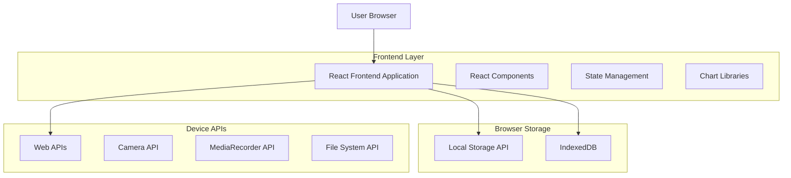
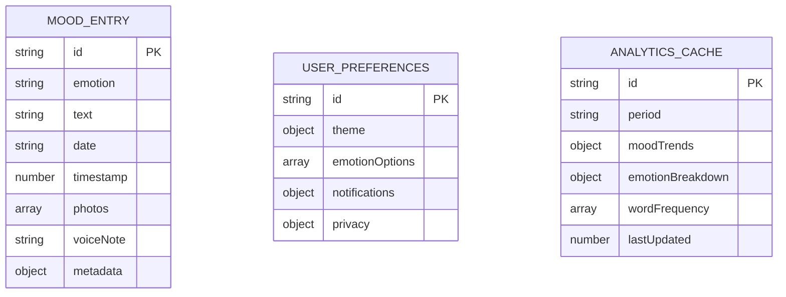
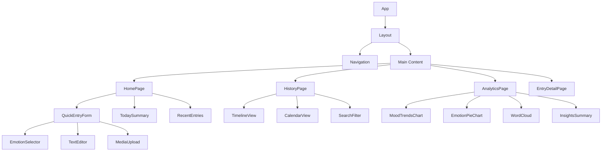

# Mood Journal App - Technical Architecture Document

## 1. Architecture Design



## 2. Technology Description

- Frontend: React@18 + TypeScript + Next.js@15 + TailwindCSS@4
- Charts: Recharts@2.15 for analytics visualization
- Storage: IndexedDB for structured data, Local Storage for preferences
- Media: Web APIs for camera access and audio recording
- UI Components: Radix UI primitives with custom styling
- State Management: React Context + useReducer for complex state
- Date Handling: date-fns@4.1 for calendar functionality

## 3. Route Definitions

| Route | Purpose |
|-------|---------|
| / | Home page with quick mood entry form and today's summary |
| /history | History page with timeline and calendar views of past entries |
| /analytics | Analytics dashboard with mood trends and insights |
| /entry/[id] | Individual entry detail view with edit capabilities |

## 4. Data Model

### 4.1 Data Model Definition



### 4.2 Data Definition Language

**Mood Entry Schema (IndexedDB)**
```typescript
interface MoodEntry {
  id: string; // UUID v4
  emotion: 'happy' | 'sad' | 'anxious' | 'calm' | 'excited' | 'frustrated' | 'peaceful' | 'overwhelmed';
  text: string; // User's journal text
  date: string; // YYYY-MM-DD format
  timestamp: number; // Unix timestamp
  photos: string[]; // Base64 encoded images or File URLs
  voiceNote?: string; // Base64 encoded audio or Blob URL
  metadata: {
    wordCount: number;
    hasMedia: boolean;
    editedAt?: number;
  };
}

// IndexedDB Store Configuration
const dbSchema = {
  name: 'MoodJournalDB',
  version: 1,
  stores: [
    {
      name: 'entries',
      keyPath: 'id',
      indexes: [
        { name: 'date', keyPath: 'date' },
        { name: 'emotion', keyPath: 'emotion' },
        { name: 'timestamp', keyPath: 'timestamp' }
      ]
    },
    {
      name: 'preferences',
      keyPath: 'id'
    },
    {
      name: 'analytics',
      keyPath: 'id'
    }
  ]
};
```

**User Preferences Schema (Local Storage)**
```typescript
interface UserPreferences {
  id: 'user_preferences';
  theme: {
    mode: 'light' | 'dark' | 'auto';
    primaryColor: string;
  };
  emotionOptions: {
    enabled: string[];
    customEmotions: Array<{
      name: string;
      color: string;
      icon: string;
    }>;
  };
  notifications: {
    dailyReminder: boolean;
    reminderTime: string; // HH:MM format
  };
  privacy: {
    requireAuth: boolean;
    autoLock: boolean;
    lockTimeout: number; // minutes
  };
}
```

**Analytics Cache Schema (IndexedDB)**
```typescript
interface AnalyticsCache {
  id: string; // 'weekly' | 'monthly' | 'yearly'
  period: string;
  moodTrends: Array<{
    date: string;
    averageMood: number; // 1-10 scale
    entryCount: number;
  }>;
  emotionBreakdown: Record<string, number>; // emotion -> count
  wordFrequency: Array<{
    word: string;
    count: number;
    sentiment?: number;
  }>;
  lastUpdated: number; // timestamp
}
```

## 5. Component Architecture

### 5.1 Component Hierarchy



### 5.2 Key Components

**EmotionSelector Component**
```typescript
interface EmotionSelectorProps {
  selectedEmotion: string | null;
  onEmotionSelect: (emotion: string) => void;
  emotions: Array<{
    name: string;
    color: string;
    icon: string;
  }>;
}
```

**MoodTrendsChart Component**
```typescript
interface MoodTrendsChartProps {
  data: Array<{
    date: string;
    mood: number;
    emotion: string;
  }>;
  period: 'week' | 'month' | 'year';
  onPeriodChange: (period: string) => void;
}
```

**MediaUpload Component**
```typescript
interface MediaUploadProps {
  onPhotoAdd: (photo: string) => void;
  onVoiceAdd: (audio: string) => void;
  maxPhotos?: number;
  maxAudioDuration?: number; // seconds
}
```

## 6. Performance Considerations

### 6.1 Data Management
- Implement virtual scrolling for large entry lists
- Cache analytics calculations to avoid recomputation
- Lazy load images and audio files
- Compress media files before storage

### 6.2 Storage Optimization
- Use IndexedDB for structured data with indexing
- Implement data cleanup for old analytics cache
- Compress text entries using LZ-string
- Limit media file sizes (photos: 2MB, audio: 5MB)

### 6.3 User Experience
- Implement offline-first architecture
- Add loading states for all async operations
- Use optimistic updates for immediate feedback
- Implement progressive web app features

## 7. Security & Privacy

### 7.1 Data Protection
- All data stored locally on device
- No server-side data transmission
- Optional device-level encryption
- Secure deletion of sensitive data

### 7.2 Privacy Features
- Optional app lock with PIN/biometric
- Private mode for sensitive entries
- Data export/import functionality
- Clear data option in settings