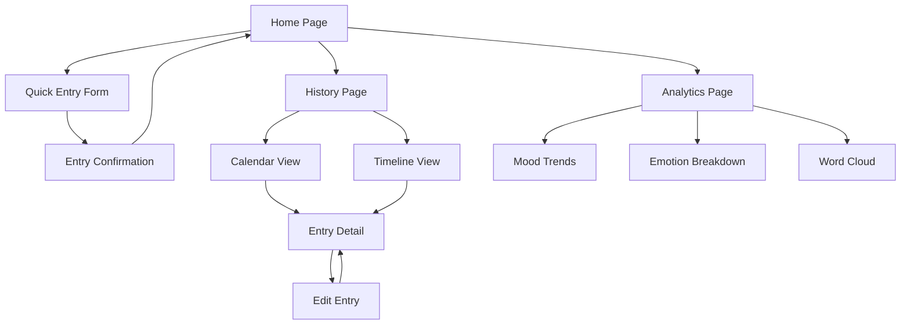

# Mood Journal App - Product Requirements Document

## 1. Product Overview

A daily mood tracking application that helps users log emotions, thoughts, and memories with multimedia support. The app focuses on mental wellness by providing intuitive mood logging, comprehensive history tracking, and insightful analytics to help users understand their emotional patterns and promote self-care habits.

## 2. Core Features

### 2.1 User Roles

| Role | Registration Method | Core Permissions |
|------|---------------------|------------------|
| User | Local app usage (no registration required) | Can create, view, edit, and delete personal mood entries |

### 2.2 Feature Module

Our mood journal app consists of the following main pages:
1. **Home page**: quick mood entry form, today's summary, recent entries preview
2. **History page**: chronological entry list, calendar view, search and filter options
3. **Analytics page**: mood trends chart, emotion breakdown pie chart, word cloud visualization
4. **Entry detail page**: full entry view, edit capabilities, media attachments

### 2.3 Page Details

| Page Name | Module Name | Feature description |
|-----------|-------------|---------------------|
| Home page | Quick Entry Form | Select emotion from predefined options (happy, sad, anxious, calm, excited, frustrated, peaceful, overwhelmed), add text notes, attach photo or record voice note |
| Home page | Today's Summary | Display current date, mood streak counter, quick stats for motivation |
| Home page | Recent Entries | Show last 3-5 entries with emotion icons and preview text |
| History page | Entry Timeline | Scroll through chronological list of all entries with date, emotion, and text preview |
| History page | Calendar View | Interactive calendar showing mood colors for each day, click to view specific entries |
| History page | Search & Filter | Search by text content, filter by emotion type, date range selection |
| Analytics page | Mood Trends Chart | Line chart showing mood patterns over time (weekly/monthly views) |
| Analytics page | Emotion Breakdown | Pie chart displaying percentage distribution of logged emotions |
| Analytics page | Word Cloud | Visual representation of frequently used words in journal entries |
| Analytics page | Insights Summary | Monthly mood averages, streak tracking, personalized observations |
| Entry Detail page | Full Entry View | Complete entry with timestamp, emotion, full text, and all attachments |
| Entry Detail page | Edit Functionality | Modify emotion, edit text, add/remove photos or voice notes |
| Entry Detail page | Media Gallery | View photos in full size, play voice recordings with controls |

## 3. Core Process

**Daily Logging Flow:**
User opens app → selects current emotion from visual emotion picker → writes optional text notes → optionally adds photo from camera/gallery or records voice note → saves entry → receives confirmation and motivation message

**History Review Flow:**
User navigates to History → chooses between timeline scroll or calendar view → clicks on specific entry → views full details → optionally edits entry → returns to history view

**Analytics Exploration Flow:**
User opens Analytics → views mood trend chart with time period selection → explores emotion breakdown pie chart → examines word cloud for insights → reads personalized summary and streaks

## 4. User Interface Design

### 4.1 Design Style

- **Primary Colors**: Soft pastels - lavender (#E6E6FA), sage green (#9CAF88), warm beige (#F5F5DC)
- **Secondary Colors**: Muted blues (#B0C4DE), soft pinks (#F0E6FF), gentle yellows (#FFF8DC)
- **Button Style**: Rounded corners (12px radius), soft shadows, gentle hover animations
- **Typography**: Inter or Poppins font family, 16px base size, generous line spacing (1.6)
- **Layout Style**: Card-based design with ample white space, floating action buttons, minimal navigation
- **Icons**: Rounded, friendly emotion icons with subtle gradients, nature-inspired elements

### 4.2 Page Design Overview

| Page Name | Module Name | UI Elements |
|-----------|-------------|-------------|
| Home page | Quick Entry Form | Large emotion selector with colorful circular buttons, expandable text area with placeholder "How are you feeling today?", floating camera/microphone buttons |
| Home page | Today's Summary | Gradient card with current date, streak counter with flame icon, motivational quote in italic text |
| History page | Calendar View | Month grid with emotion-colored dots, smooth transitions, gentle hover effects on dates |
| History page | Timeline | Vertical timeline with emotion icons, card-style entries, infinite scroll with loading animations |
| Analytics page | Charts | Soft-colored charts with rounded elements, interactive tooltips, smooth animations on data changes |
| Entry Detail page | Media Display | Rounded image containers, audio waveform visualization, gentle modal overlays |

### 4.3 Responsiveness

Mobile-first responsive design with touch-optimized interactions. Emotion selector adapts from grid layout on mobile to horizontal layout on desktop. Charts scale appropriately across devices with touch gestures for mobile navigation. Voice recording optimized for mobile with haptic feedback.