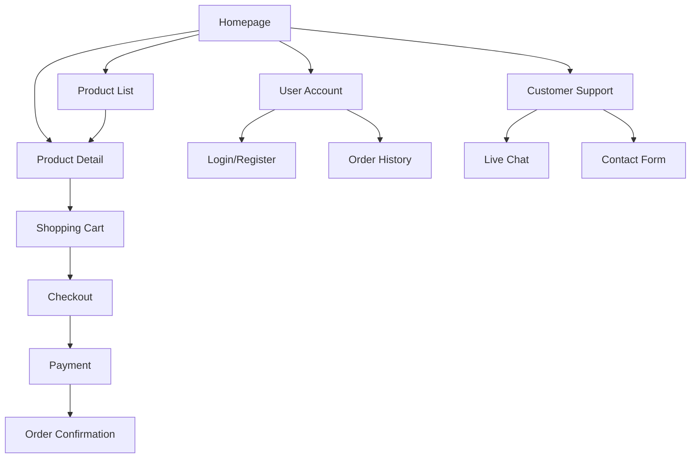

# Women's Fashion E-commerce Site - Product Requirements Document

## 1. Product Overview
A modern women's fashion e-commerce platform inspired by Zara and H&M, targeting US and European markets with clean, mobile-friendly design and seamless shopping experience.

The platform solves the need for accessible, trendy fashion shopping online, serving fashion-conscious women who value quality, style, and convenience in their shopping experience.

Target market value: Capture the growing online fashion retail market by providing a premium shopping experience that rivals established fashion retailers.

## 2. Core Features

### 2.1 User Roles

| Role | Registration Method | Core Permissions |
|------|---------------------|------------------|
| Guest User | No registration required | Browse products, view details, add to cart |
| Registered User | Email registration | Full shopping access, order history, saved items, faster checkout |
| Admin | Internal system access | Product management, order management, customer support |

### 2.2 Feature Module

Our women's fashion e-commerce site consists of the following main pages:

1. **Homepage**: Hero banner with seasonal campaigns, new arrivals showcase, bestsellers section, new user welcome popup
2. **Product List Page**: Product grid with search functionality, category filters, price filters, size filters, color filters, sorting options
3. **Product Detail Page**: High-quality product images with zoom, size selection, color variants, product reviews, size guide, add to cart functionality
4. **Shopping Cart**: Item management, quantity adjustment, price calculation, promo code application, checkout initiation
5. **Checkout Page**: Shipping information form, payment method selection, order summary, order confirmation
6. **User Account**: Login/signup forms, order history, profile management, saved items, shipping addresses
7. **Customer Support**: Live chat integration, contact form, FAQ section

### 2.3 Page Details

| Page Name | Module Name | Feature Description |
|-----------|-------------|---------------------|
| Homepage | Hero Banner | Display seasonal campaigns with high-impact visuals and call-to-action buttons |
| Homepage | New Arrivals | Showcase latest products with quick view and add to cart options |
| Homepage | Bestsellers | Display top-selling items with social proof indicators |
| Homepage | New User Popup | Welcome modal for first-time visitors with signup incentive |
| Product List | Search Bar | Enable text-based product search with autocomplete suggestions |
| Product List | Filter Panel | Provide category, price, size, color, and brand filtering options |
| Product List | Product Grid | Display products in responsive grid with hover effects and quick actions |
| Product List | Sort Options | Allow sorting by price, popularity, newest, and customer rating |
| Product Detail | Image Gallery | Show multiple product images with zoom functionality and 360-degree view |
| Product Detail | Product Info | Display title, price, description, size guide, and availability status |
| Product Detail | Size Selection | Provide size options with availability indicators |
| Product Detail | Reviews Section | Show customer reviews with ratings and photo uploads |
| Product Detail | Add to Cart | Enable cart addition with size/color selection and quantity adjustment |
| Shopping Cart | Item Management | Allow quantity changes, item removal, and save for later functionality |
| Shopping Cart | Price Calculator | Show itemized pricing, taxes, shipping costs, and total amount |
| Shopping Cart | Promo Codes | Enable discount code application with validation |
| Checkout | Shipping Form | Collect delivery address with address validation and suggestions |
| Checkout | Payment Methods | Support Visa, PayPal, Apple Pay, and Klarna payment options |
| Checkout | Order Summary | Display final order details with edit options |
| User Account | Authentication | Provide email-based login and registration with password recovery |
| User Account | Order History | Show past orders with tracking information and reorder options |
| User Account | Profile Management | Allow personal information and preference updates |
| Customer Support | Live Chat | Integrate real-time chat support during business hours |
| Customer Support | Contact Form | Provide email-based support with category selection |

## 3. Core Process

**Guest User Shopping Flow:**
Users browse homepage → explore product categories → view product details → add items to cart → proceed to checkout → create account or guest checkout → enter shipping info → select payment method → complete purchase

**Registered User Shopping Flow:**
Users login → browse personalized homepage → use saved filters/preferences → add items to cart → quick checkout with saved info → select payment method → complete purchase → view order confirmation

**Customer Support Flow:**
Users access support via chat widget or contact page → select inquiry type → connect with support agent or submit form → receive assistance → follow up if needed

## 4. User Interface Design

### 4.1 Design Style

- **Primary Colors**: Black (#000000), White (#FFFFFF), Light Gray (#F5F5F5)
- **Secondary Colors**: Soft Beige (#F7F3E9), Navy Blue (#1E3A8A)
- **Button Style**: Clean rectangular buttons with subtle hover animations and rounded corners (4px radius)
- **Typography**: Modern sans-serif font (Inter or similar), 16px base size, 14px for secondary text, 24px+ for headings
- **Layout Style**: Card-based product displays, top navigation with mega menu, clean grid layouts with generous white space
- **Icons**: Unified line-style icons (Lucide React), consistent stroke width, no emojis
- **Animations**: Subtle hover effects, smooth transitions (300ms), gentle fade-ins for content loading

### 4.2 Page Design Overview

| Page Name | Module Name | UI Elements |
|-----------|-------------|-------------|
| Homepage | Hero Banner | Full-width image/video background, overlay text with CTA button, subtle parallax scrolling |
| Homepage | Product Sections | 4-column grid on desktop, 2-column on tablet, 1-column on mobile, hover effects with quick view |
| Product List | Filter Sidebar | Collapsible filter panel, checkbox groups, price range slider, clear filters option |
| Product List | Product Grid | Responsive grid layout, product cards with image, title, price, quick add button |
| Product Detail | Image Gallery | Large main image with thumbnail strip, zoom on hover, mobile swipe gestures |
| Product Detail | Product Info | Right-side panel with product details, size selector, quantity input, prominent add to cart button |
| Shopping Cart | Cart Items | List layout with product images, editable quantities, remove buttons, subtotal calculations |
| Checkout | Form Layout | Two-column layout with form on left, order summary on right, progress indicator |
| User Account | Dashboard | Tab-based navigation, clean form layouts, order cards with status indicators |

### 4.3 Responsiveness

Desktop-first responsive design with mobile optimization:
- **Desktop**: Full-featured layout with hover states and expanded navigation
- **Tablet**: Adapted grid layouts, touch-friendly buttons, collapsible navigation
- **Mobile**: Single-column layouts, thumb-friendly touch targets, swipe gestures for image galleries
- **Touch Optimization**: Minimum 44px touch targets, swipe gestures for product images, pull-to-refresh functionality