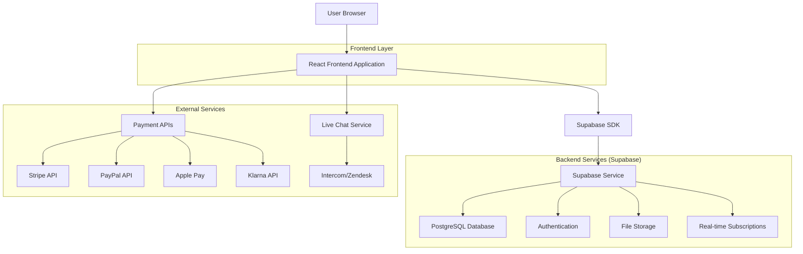
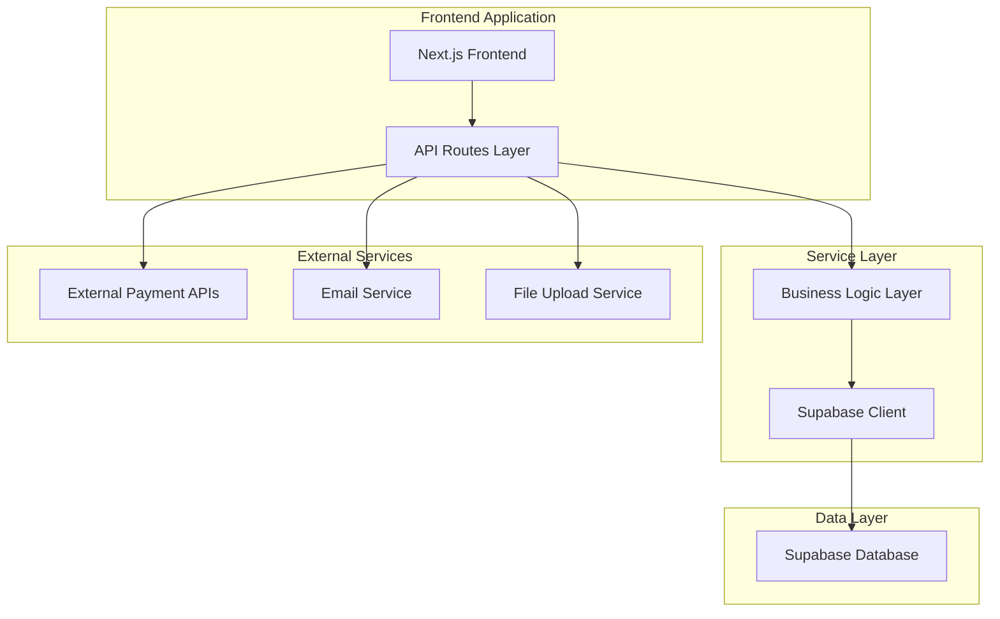

# Women's Fashion E-commerce Site - Technical Architecture Document

## 1. Architecture Design



## 2. Technology Description

- **Frontend**: React@18 + TypeScript + Tailwind CSS@4 + Next.js@15 + Framer Motion
- **Backend**: Supabase (Authentication, Database, Storage, Real-time)
- **Payment Processing**: Stripe, PayPal SDK, Apple Pay, Klarna
- **UI Components**: Radix UI + Lucide React Icons
- **State Management**: React Query + React Hook Form
- **Image Optimization**: Next.js Image Component + Supabase Storage

## 3. Route Definitions

| Route | Purpose |
|-------|---------|
| / | Homepage with hero banner, new arrivals, and bestsellers |
| /products | Product listing page with search and filters |
| /products/[slug] | Individual product detail page |
| /cart | Shopping cart management |
| /checkout | Checkout process with shipping and payment |
| /account | User dashboard and profile management |
| /account/orders | Order history and tracking |
| /account/orders/[id] | Individual order details |
| /login | User authentication login page |
| /register | User registration page |
| /support | Customer support and contact information |
| /size-guide | Size guide and fitting information |
| /coming-soon | Placeholder for unimplemented features |

## 4. API Definitions

### 4.1 Core API

**Product Management**
```
GET /api/products
```
Request:
| Param Name | Param Type | isRequired | Description |
|------------|------------|------------|-------------|
| category | string | false | Filter by product category |
| search | string | false | Search term for products |
| minPrice | number | false | Minimum price filter |
| maxPrice | number | false | Maximum price filter |
| size | string | false | Filter by available sizes |
| color | string | false | Filter by color |
| sort | string | false | Sort order (price_asc, price_desc, newest, popular) |
| page | number | false | Page number for pagination |
| limit | number | false | Items per page |

Response:
| Param Name | Param Type | Description |
|------------|------------|-------------|
| products | Product[] | Array of product objects |
| totalCount | number | Total number of products |
| hasMore | boolean | Whether more pages exist |

**Cart Management**
```
POST /api/cart/add
```
Request:
| Param Name | Param Type | isRequired | Description |
|------------|------------|------------|-------------|
| productId | string | true | Product identifier |
| size | string | true | Selected size |
| color | string | true | Selected color |
| quantity | number | true | Quantity to add |

Response:
| Param Name | Param Type | Description |
|------------|------------|-------------|
| success | boolean | Operation success status |
| cartItem | CartItem | Added cart item details |

**Order Processing**
```
POST /api/orders/create
```
Request:
| Param Name | Param Type | isRequired | Description |
|------------|------------|------------|-------------|
| items | CartItem[] | true | Array of cart items |
| shippingAddress | Address | true | Delivery address |
| paymentMethod | string | true | Payment method (stripe, paypal, apple_pay, klarna) |
| paymentToken | string | true | Payment processor token |

Response:
| Param Name | Param Type | Description |
|------------|------------|-------------|
| orderId | string | Created order identifier |
| status | string | Order status |
| total | number | Order total amount |

## 5. Server Architecture Diagram



## 6. Data Model

### 6.1 Data Model Definition

```mermaid
erDiagram
    USERS ||--o{ ORDERS : places
    USERS ||--o{ CART_ITEMS : has
    USERS ||--o{ REVIEWS : writes
    PRODUCTS ||--o{ CART_ITEMS : contains
    PRODUCTS ||--o{ ORDER_ITEMS : includes
    PRODUCTS ||--o{ REVIEWS : receives
    PRODUCTS ||--o{ PRODUCT_IMAGES : has
    PRODUCTS }|--|| CATEGORIES : belongs_to
    ORDERS ||--o{ ORDER_ITEMS : contains
    
    USERS {
        uuid id PK
        string email UK
        string password_hash
        string first_name
        string last_name
        jsonb shipping_addresses
        timestamp created_at
        timestamp updated_at
    }
    
    PRODUCTS {
        uuid id PK
        string name
        string slug UK
        text description
        decimal price
        decimal compare_price
        uuid category_id FK
        jsonb sizes
        jsonb colors
        integer stock_quantity
        boolean is_active
        timestamp created_at
        timestamp updated_at
    }
    
    CATEGORIES {
        uuid id PK
        string name
        string slug UK
        text description
        integer sort_order
        boolean is_active
    }
    
    PRODUCT_IMAGES {
        uuid id PK
        uuid product_id FK
        string image_url
        string alt_text
        integer sort_order
        boolean is_primary
    }
    
    ORDERS {
        uuid id PK
        uuid user_id FK
        string status
        decimal subtotal
        decimal tax_amount
        decimal shipping_cost
        decimal total_amount
        jsonb shipping_address
        jsonb billing_address
        string payment_method
        string payment_status
        timestamp created_at
        timestamp updated_at
    }
    
    ORDER_ITEMS {
        uui