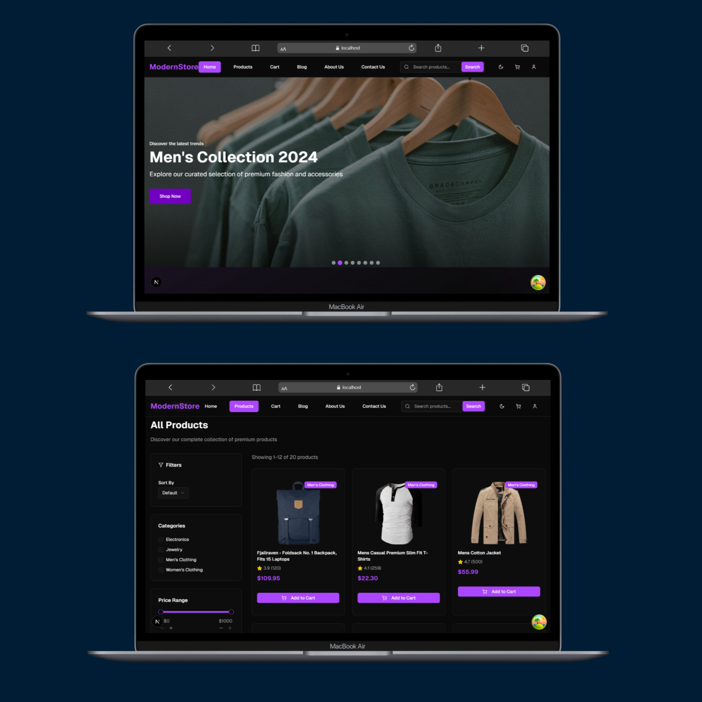
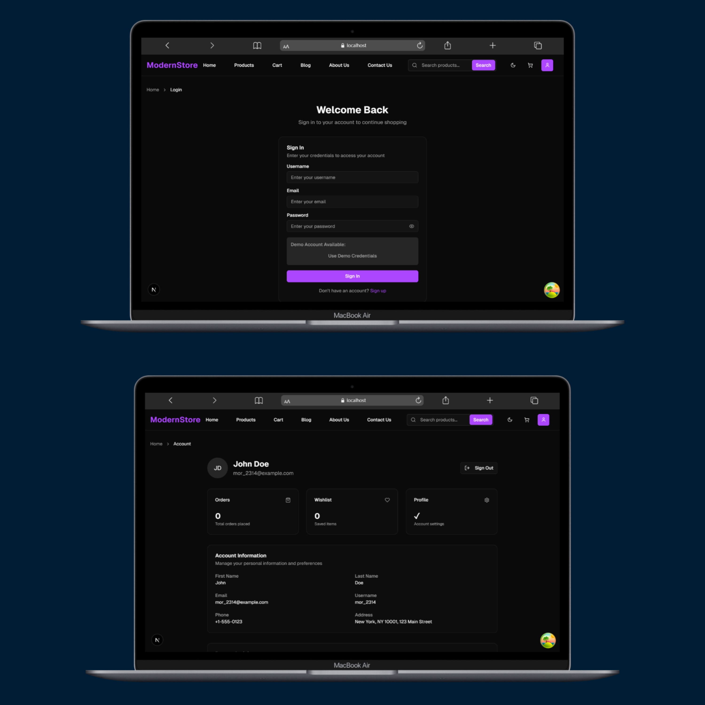

# E-commerce Site

A modern e-commerce website built with Next.js and TypeScript.

## What is this project?

A full-featured online shopping platform with user authentication, product management, and shopping cart functionality.

## Live Demo
You can check out the live demo of the project at the following link : [E-commerce](https://e-commerce-g2za.vercel.app/)

## Key Features

- 🔐 User Authentication (Login/Register)
- 🛒 Shopping Cart
- 👤 User Dashboard
- 📱 Responsive Design
- 🔒 Secure Authentication with JWT
- 📋 Form Validation
- 🎨 Modern UI with Tailwind CSS

## Technologies Used

- **Frontend:** Next.js 14, React, TypeScript
- **Styling:** Tailwind CSS
- **Forms:** React Hook Form + Zod validation
- **Authentication:** JWT tokens, cookies
- **Icons:** Lucide React

## APIs Used

- Custom authentication API endpoints
- Local storage for user data persistence
- Cookie-based session management

## How to Run

1. **Clone the repository**
   ```bash
   git clone <repository-url>
   cd ecommerce-site_2
   ```

2. **Install dependencies**
   ```bash
   npm install
   ```

3. **Run the development server**
   ```bash
   npm run dev
   ```

4. **Open your browser**
   ```
   http://localhost:3000
   ```

## Project Structure

```
src/
├── components/     # Reusable UI components
├── pages/         # Next.js pages
├── hooks/         # Custom React hooks
├── utils/         # Utility functions
└── types/         # TypeScript type definitions
```

That's it! The project should be running locally on your machine.

## 📸 Sample Screenshot

Below is a sample screenshot of the project:




