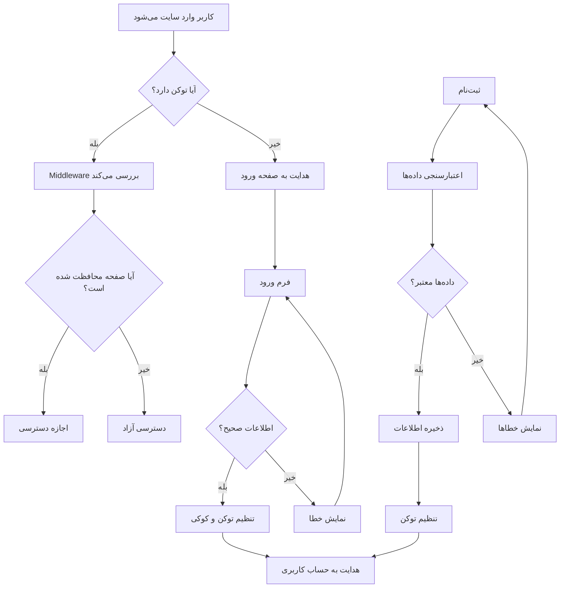

# راهنمای کامل سیستم احراز هویت (Authentication System)

## 📋 فهرست مطالب
1. [نمای کلی سیستم](#نمای-کلی-سیستم)
2. [ساختار فایل‌ها](#ساختار-فایل‌ها)
3. [انواع Type ها و Interface ها](#انواع-type-ها-و-interface-ها)
4. [فرآیند ثبت‌نام (Registration)](#فرآیند-ثبت‌نام-registration)
5. [فرآیند ورود (Login)](#فرآیند-ورود-login)
6. [Middleware و بررسی احراز هویت](#middleware-و-بررسی-احراز-هویت)
7. [مدیریت وضعیت کاربر](#مدیریت-وضعیت-کاربر)
8. [نمودار جریان کامل](#نمودار-جریان-کامل)

---

## 🔍 نمای کلی سیستم

سیستم احراز هویت این پروژه شامل موارد زیر است:
- **ثبت‌نام کاربران جدید**
- **ورود کاربران موجود**
- **محافظت از صفحات خصوصی**
- **مدیریت وضعیت کاربر**
- **ذخیره‌سازی امن اطلاعات**


---

## 📁 ساختار فایل‌ها

```
ecommerce-site_2/
├── middleware.ts                    # میدل‌ور محافظت از روت‌ها
├── app/
│   ├── login/page.tsx              # صفحه ورود
│   └── register/page.tsx           # صفحه ثبت‌نام
├── components/auth/
│   ├── auth-provider.tsx           # مدیریت وضعیت احراز هویت
│   ├── login-form.tsx              # فرم ورود
│   └── register-form.tsx           # فرم ثبت‌نام
├── shared/types/
│   └── auth.ts                     # تعریف انواع داده‌ها
└── lib/
    └── auth-constants.ts           # ثابت‌های احراز هویت
```

---

## 🏗️ انواع Type ها و Interface ها

### 1. Interface کاربر (User)
```typescript
interface User {
  id: number
  email: string
  username: string
  name: {
    firstname: string
    lastname: string
  }
  phone: string
  address: {
    street: string
    city: string
  }
}
```

### 2. داده‌های ثبت‌نام (RegisterUserData)
```typescript
interface RegisterUserData {
  email: string
  username: string
  password: string
  firstname: string
  lastname: string
  phone: string
  street: string
  city: string
}
```

### 3. اطلاعات ورود (LoginCredentials)
```typescript
interface LoginCredentials {
  username: string
  email: string
  password: string
}
```

### 4. Context احراز هویت (AuthContextType)
```typescript
interface AuthContextType {
  user: User | null
  login: (username: string, email: string, password: string) => Promise<boolean>
  register: (userData: RegisterUserData) => Promise<boolean>
  logout: () => void
  updateUser: (user: User) => void
  isLoading: boolean
}
```

### 5. خطاهای فرم (FormErrors)
```typescript
interface FormErrors {
  [key: string]: string | undefined
}
```


---

## 📝 فرآیند ثبت‌نام (Registration)

### مراحل ثبت‌نام:

1. **ورود اطلاعات توسط کاربر**
   - نام و نام خانوادگی
   - ایمیل و نام کاربری
   - رمز عبور و تأیید رمز عبور
   - شماره تلفن
   - آدرس (خیابان و شهر)

2. **اعتبارسنجی داده‌ها**
   ```typescript
   // اعتبارسنجی ایمیل
   const validateEmail = (email: string): string | undefined => {
     const emailRegex = /^[^\s@]+@[^\s@]+\.[^\s@]+$/
     if (!email.trim()) return "Email is required"
     if (!emailRegex.test(email)) return "Please enter a valid email address"
     return undefined
   }

   // اعتبارسنجی رمز عبور
   const validatePassword = (password: string): string | undefined => {
     if (!password) return "Password is required"
     if (password.length < 8) return "Password must be at least 8 characters"
     if (!/(?=.*[a-z])/.test(password)) return "Password must contain at least one lowercase letter"
     if (!/(?=.*[A-Z])/.test(password)) return "Password must contain at least one uppercase letter"
     if (!/(?=.*\d)/.test(password)) return "Password must contain at least one number"
     return undefined
   }
   ```

3. **ذخیره‌سازی اطلاعات**
   ```typescript
   const register = async (userData: RegisterUserData): Promise<boolean> => {
     // ایجاد کاربر جدید
     const newUser: User = {
       id: Date.now(),
       email: userData.email,
       username: userData.username,
       name: { 
         firstname: userData.firstname, 
         lastname: userData.lastname 
       },
       phone: userData.phone,
       address: {
         street: userData.street,
         city: userData.city
       }
     }

     // ذخیره در localStorage
     localStorage.setItem(AUTH_STORAGE_KEYS.REGISTERED_USERNAME, userData.username)
     localStorage.setItem(AUTH_STORAGE_KEYS.REGISTERED_EMAIL, userData.email)
     localStorage.setItem(AUTH_STORAGE_KEYS.REGISTERED_PASSWORD, userData.password)
     localStorage.setItem(AUTH_STORAGE_KEYS.USER_DATA, JSON.stringify(newUser))

     // تنظیم کوکی امن
     const simulatedToken = "simulated-jwt-token"
     const isSecure = window.location.protocol === 'https:'
     document.cookie = `${AUTH_COOKIE_NAME}=${simulatedToken}; path=/; max-age=604800; ${isSecure ? 'secure;' : ''} samesite=strict`

     return true
   }
   ```


---

## 🔐 فرآیند ورود (Login)

### مراحل ورود:

1. **ورود اطلاعات ورود**
   - نام کاربری
   - ایمیل
   - رمز عبور

2. **بررسی اطلاعات محلی**
   ```typescript
   const login = async (username: string, email: string, password: string): Promise<boolean> => {
     // بررسی اطلاعات ذخیره شده محلی
     const storedUsername = localStorage.getItem(AUTH_STORAGE_KEYS.REGISTERED_USERNAME)
     const storedEmail = localStorage.getItem(AUTH_STORAGE_KEYS.REGISTERED_EMAIL)
     const storedPassword = localStorage.getItem(AUTH_STORAGE_KEYS.REGISTERED_PASSWORD)

     if (username === storedUsername && email === storedEmail && password === storedPassword) {
       // اطلاعات محلی مطابقت دارد
       const simulatedToken = "simulated-jwt-token"
       // تنظیم کوکی و localStorage
       return true
     }

     // در صورت عدم مطابقت، تلاش برای ورود از طریق API
     const response = await fetch("https://fakestoreapi.com/auth/login", {
       method: "POST",
       headers: { "Content-Type": "application/json" },
       body: JSON.stringify({ username, password })
     })

     return response.ok
   }
   ```

3. **تنظیم وضعیت کاربر**
   - ذخیره توکن در localStorage
   - تنظیم کوکی امن
   - به‌روزرسانی state کاربر
   - هدایت به صفحه حساب کاربری


---

## 🛡️ Middleware و بررسی احراز هویت

### عملکرد Middleware:

```typescript
export function middleware(request: NextRequest) {
  const { pathname } = request.nextUrl
  
  // بررسی وجود توکن احراز هویت
  const authToken = request.cookies.get('auth_token')?.value || 
                   request.headers.get('authorization')?.replace('Bearer ', '')
  
  const isAuthenticated = !!authToken
  
  // محافظت از صفحات خصوصی
  if (pathname.startsWith('/account')) {
    if (!isAuthenticated) {
      return NextResponse.redirect(new URL('/login', request.url))
    }
  }
  
  // هدایت کاربران وارد شده از صفحات ورود/ثبت‌نام
  if ((pathname === '/login' || pathname === '/register') && isAuthenticated) {
    return NextResponse.redirect(new URL('/account', request.url))
  }
  
  // تنظیم هدرهای امنیتی
  const response = NextResponse.next()
  response.headers.set('X-Frame-Options', 'DENY')
  response.headers.set('X-Content-Type-Options', 'nosniff')
  
  return response
}
```

### مسیرهای تحت پوشش:
```typescript
export const config = {
  matcher: [
    '/((?!api|_next/static|_next/image|favicon.ico|sitemap.xml|robots.txt).*)',
  ],
}
```


---

## 👤 مدیریت وضعیت کاربر

### AuthProvider Component:

```typescript
export function AuthProvider({ children }: { children: React.ReactNode }) {
  const [user, setUser] = useState<User | null>(null)
  const [isLoading, setIsLoading] = useState(true)

  // بارگذاری اولیه وضعیت کاربر
  useEffect(() => {
    const token = localStorage.getItem(AUTH_STORAGE_KEYS.TOKEN)
    const userData = localStorage.getItem(AUTH_STORAGE_KEYS.USER_DATA)
    
    if (token && userData) {
      try {
        const parsedUser = JSON.parse(userData)
        setUser(parsedUser)
      } catch (error) {
        // استفاده از کاربر پیش‌فرض در صورت خطا
        const fallbackUser: User = {
          id: 1,
          email: "user@example.com",
          username: "user",
          name: { firstname: "John", lastname: "Doe" },
          phone: "+1-555-0123",
          address: { street: "123 Main Street", city: "New York, NY 10001" }
        }
        setUser(fallbackUser)
      }
    }
    
    setIsLoading(false)
  }, [])

  // تابع خروج
  const logout = () => {
    localStorage.removeItem(AUTH_STORAGE_KEYS.TOKEN)
    localStorage.removeItem(AUTH_STORAGE_KEYS.USER_DATA)
    localStorage.removeItem(AUTH_STORAGE_KEYS.REGISTERED_USERNAME)
    localStorage.removeItem(AUTH_STORAGE_KEYS.REGISTERED_EMAIL)
    localStorage.removeItem(AUTH_STORAGE_KEYS.REGISTERED_PASSWORD)
    
    document.cookie = `${AUTH_COOKIE_NAME}=; path=/; expires=Thu, 01 Jan 1970 00:00:00 GMT`
    setUser(null)
  }

  return (
    <AuthContext.Provider value={{ user, login, register, logout, updateUser, isLoading }}>
      {children}
    </AuthContext.Provider>
  )
}
```

### استفاده از Hook:
```typescript
export function useAuth() {
  const context = useContext(AuthContext)
  if (context === undefined) {
    throw new Error("useAuth must be used within an AuthProvider")
  }
  return context
}
```


---

## 🔄 نمودار جریان کامل

### جریان کامل احراز هویت:




---

## 🔧 ویژگی‌های امنیتی

### 1. محافظت از کوکی‌ها:
- استفاده از `SameSite=Strict`
- تنظیم `Secure` برای HTTPS
- محدودیت زمانی (7 روز)

### 2. اعتبارسنجی داده‌ها:
- بررسی فرمت ایمیل
- قوانین پیچیدگی رمز عبور
- اعتبارسنجی شماره تلفن
- محدودیت کاراکتر برای نام‌ها

### 3. مدیریت خطاها:
- نمایش خطاهای مناسب
- پیام‌های راهنما
- بازخورد بصری

### 4. تجربه کاربری:
- نمایش/مخفی کردن رمز عبور
- بارگذاری خودکار اطلاعات ثبت شده
- حساب‌های نمونه برای تست

---

## 📚 خلاصه

سیستم احراز هویت این پروژه شامل:

✅ **ثبت‌نام کامل** با اعتبارسنجی جامع  
✅ **ورود امن** با پشتیبانی از چندین منبع  
✅ **محافظت از مسیرها** توسط middleware  
✅ **مدیریت وضعیت** با React Context  
✅ **ذخیره‌سازی امن** در localStorage و کوکی‌ها  
✅ **تجربه کاربری مناسب** با بازخورد مناسب  

این سیستم قابلیت گسترش برای پروژه‌های بزرگ‌تر را دارد و می‌تواند به راحتی با سرویس‌های احراز هویت خارجی ادغام شود.

